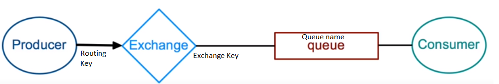

```
Pre-requisites:

Downloading RabbitMQ Docker Container:
docker pull rabbitmq:3-management

Running RabbitMQ Docker Container:
docker run -d -p 15672:15672 -p 5672:5672 --name rmq
```

* ### RabbitMQ Direct exchange
___



* ### Publisher
  * Create single TCP connection
  * Create single channel
  * Assert exchange
  * Publish message to exchange with routing key for direct exchange.
  * Close exchange
  * Close connection

* ### Consumer
  * Create single TCP connection
  * Create single channel
  * Assert exchange
  * Assert queue
  * Create binding of exchange with queue
  * Asynchronously consume message from the queue
  * Send Acknowledgement back for dequeueing the message from queue (Optional)
  * Closing connection leads to error (Don't close connection on consumer side)